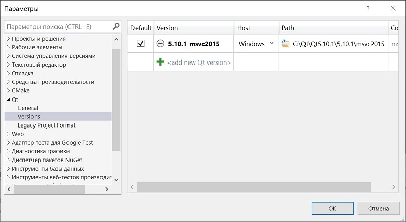
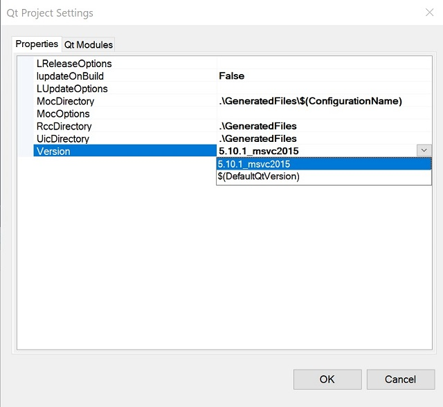

<h2 align="center">Как собрать решение GranitCrypt, использующее Qt.</h2>

Для сборки необходимо установить Visual Studio 2017,  плагин для работы с Qt qt-vsaddin-msvc2017-2.8.0.vsix, установленный набор инструментов платформы v140. Скачать Qt 5.10.1.

Открываем решение: 

Visual Studio предлагает нам перенацелить проект. Нажимаем "Отмена". 
 
Задаем версию Qt: 
 
Устанавливаем проектам NativeDll, GranitCore, EasyCript версию Qt: 
 
 

Переводим в Release: 
 
Назначаем проект EasyCript автозагружаемым проектом. 
Последовательно собираем проекты: 
1. cryptlib - библиотека работы с RSA; 
2. lib_mpir_cxx - MPIR Library(библиотека для работы с большими числами); 
3. lib_mpir_gc; 
4. GranitCore; 
4. NativeDll - C++ библиотека, которую могу использовать внешние;программы. 
5. EasyCript - программа шифрования «Роза»; 

