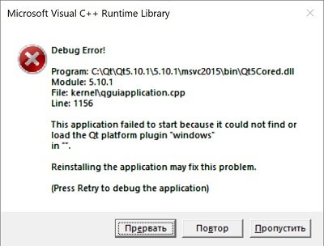
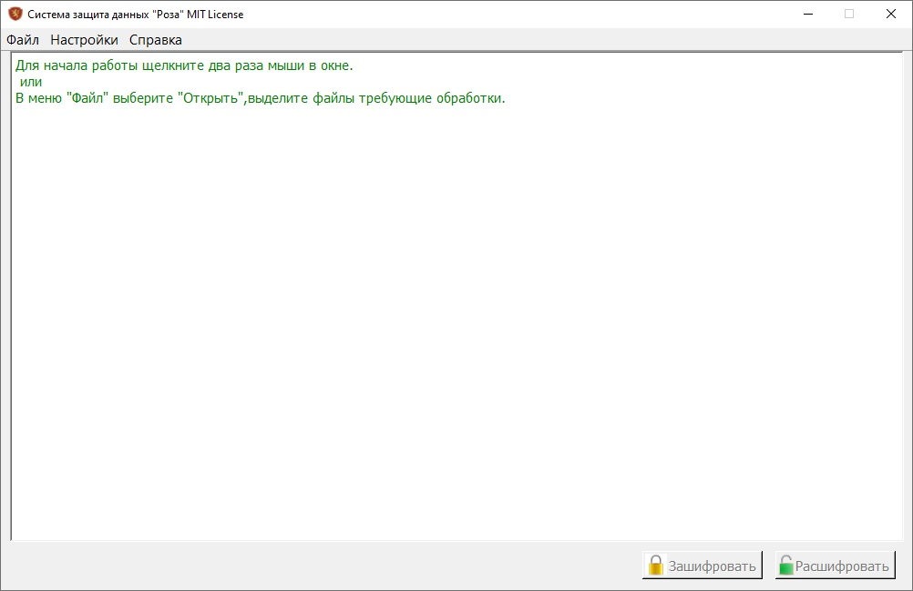

<h2 align="center">Как собрать решение GranitCrypt, использующее Qt.</h2>

Для сборки необходимо установить Visual Studio 2017,  плагин для работы с Qt qt-vsaddin-msvc2017-2.8.0.vsix, установленный набор инструментов платформы v140. Скачать Qt 5.10.1.

Открываем решение: 

Visual Studio предлагает нам перенацелить проект. Нажимаем "Отмена". 
 
Задаем версию Qt: 
 
Устанавливаем проектам NativeDll, GranitCore, EasyCript версию Qt: 
 
 

Назначаем проект EasyCript автозагружаемым проектом. 
Используем собранные библиотеки CryptoPP, Mpir. 
Копируем все файлы из \Binaries\CryptoPPLib.zip в \Native\CryptoPP\Win32\Output\
и \Binaries\Mpir.zip в \Native\Mpir 
CryptoPP необходим для работы с RSA и чтения ASN1. Mpir – библиотека больших чисел, для подписи файлов. 
Последовательно собираем проекты: 
1. GranitCore - ядро библиотеки; 
2. NativeDll - C++ библиотека, которую могут использовать внешние программы; 
3. EasyCript - программа шифрования «Роза»; 

Для полноценной работы программы нужно скопировать все dll файлы из архива программы «Роза». 
В случае возникновения ошибки 
 
необходимо в \platforms из папки Qt (c:\Qt\Qt5.10.1\5.10.1\msvc2015\plugins\platforms\qwindowsd.dll) скопировать файл
qwindowsd.dll

После успешной сборки, появиться окно программы: 

