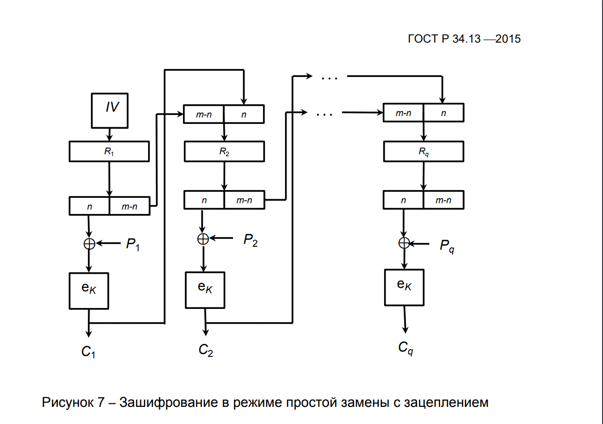
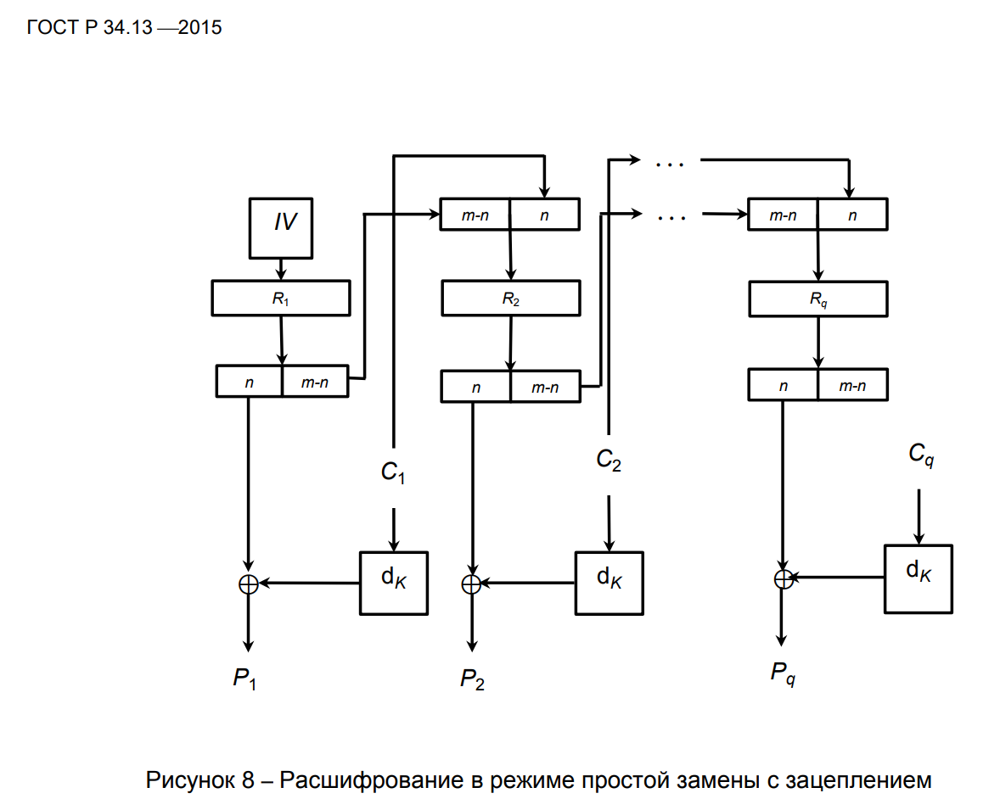

<h2 align="center">Режимы работы блочного шифра.</h2>

В данном проекте блочный шифр работает в режиме простой замены с зацеплением.

На рисунках показан принцип работы. Где: IV-начальный вектор(случайное число), P-кодируемый блок данных, C-зашифрованные данные, Еk-алгоритм кодирования с использованием ключа k.

