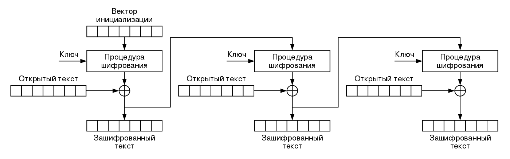

<h2 align="center">Режимы работы блочного шифра.</h2>

Для кодирования данных блочный шифр работает в режиме простой замены с зацеплением.

На рисунках показан принцип работы. Где: IV-начальный вектор(случайное число), P-кодируемый блок данных, C-зашифрованные данные, Еk-алгоритм кодирования с использованием ключа k.

Для работы с контейнерами используется режим CFB(Cipher Feedback Mode).

Режим обратной связи по шифротексту, режим гаммирования с обратной связью -для шифрования следующего блока открытого текста он складывается по модулю 2 с перешифрованным (блочным шифром) результатом шифрования предыдущего блока.

