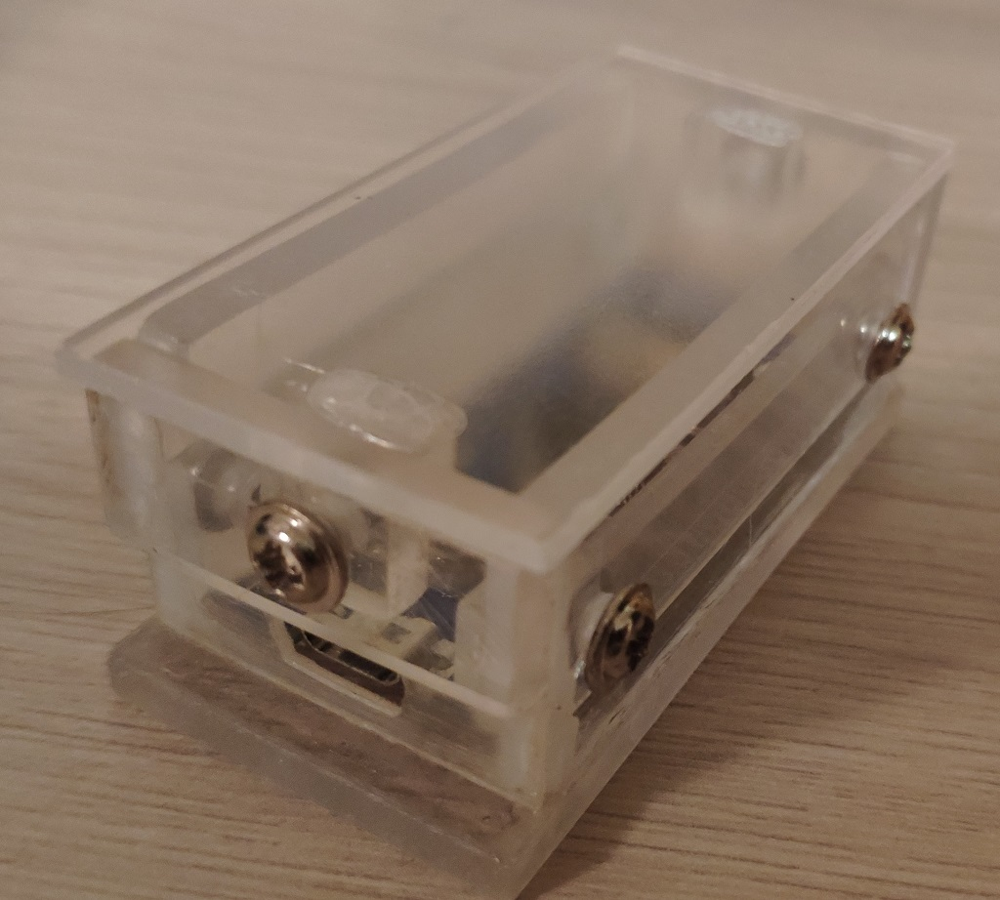

<h2 align="center">Система защиты программ с использованием аппаратного ключа</h2>

Генерируется ключ продукта и ключ RSA.
С помощью программы показанной на рисунке, оба ключа зашивается в флеш память микроконтроллера.
<a href="./KeyProger/KeyProger.md">Инструкция по созданию ключа.</a>
 
Режим «простого» пользователя: 
 
Режим «Эксперт» (доступен после ввода пароля на главной форме): 
 

Защищаемая программа обращается к микроконтроллеру, он посылает шифрованный ключ продукта. Программа расшифровывает и проверяет данные. 

Получить ключ продукта из микроконтроллера нельзя – флеш память защищена от считывания (если после прошивки вы поставили нужную галочку).
У пользователя есть плата, и RSA ключ (файл) который использует для расшифровки. Из этого ни как нельзя извлечь ключ продукта.

Для генерации ключа продукта и его проверки используется специальный алгоритм.

Применено гибридное шифрование – AES и RSA. Сеансовый ключ используется AES для шифрования серийного номера, RSA - шифрует сеансовый ключ. По проводу всегда передаются случайные данные.

<a href="./KeySoft/Протокол обмена с USB ключом.docx">Протокол обмена с USB ключом (.docx)</a>

 

Используется заводская плата на которую прикреплена плата защиты от статического электричества.

Разводка платы защиты для изготовления методом ЛУТ 

<a href="./BoardProtect.lay">Файл модели - BoardProtect.lay </a>

