

<h2 align="center">Настройка USB ключа.</h2>

Для создания аппаратного ключа потребуется плата с микроконтроллером stm32f103c8t6. 
Подобная плата обычно имеет название «stm32 blue pill» или «отладочная плата STM32». Важно купить плату с оригинальным микроконтроллером от фирмы st microelectronics. Так как существует достаточно много копий с китайским ARM. 
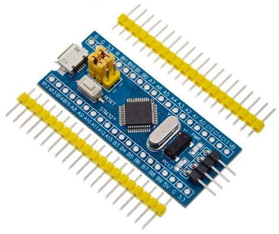

Скачиваем IDE Keil v5.36. Собираем прошивку из \HardwareProjects\STM32UsbKey.
Или берем готовую из \Binaries\STM32UsbKeyFirmware.zip. 
<a href="../LoadFirmware/LoadFirmware.md">Прошиваем микроконтроллер.</a>

Генерируем ключ RSA, которым микроконтроллер будет шифровать сеансовый ключ.
Для этого из Git Bash запускаем \Native\HardwareKeyExample\KeyProger\genkey.bat.
Git Bash знает где лежит openssl, поэтому используем его (должен быть установлен git и tortoise git). 
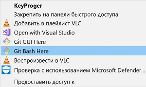 
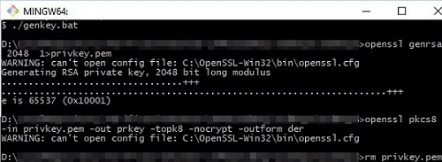

В .bat файле указано: 
Генерация RSA ключа длиной 2048 бит, и помещение его в .pem контейнер. 
Конвертируем ключ из формата .pem в pkc8. 
Удаление ключа в формате pem. 

В корне папки будет создан файл закрытого ключа rsa - "privateKey".

Для загрузки серийного номера и ключа RSA в флеш память микроконтроллера, используется программа «KeyProger».
Исходники можно найти в \Native\HardwareKeyExample\KeyProger

После запуска – возможен выбор двух режимов. 
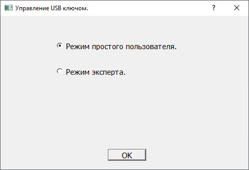

Режим «простого пользователя» позволяет загрузить серийный номер и ключ RSA: 
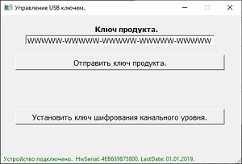

Для настройки ключа потребуется режим «эксперт».

Для входа в режим «эксперт» потребуется ввести пароль, прописанный в файле \Native\HardwareKeyExample\KeyProger\config.h 
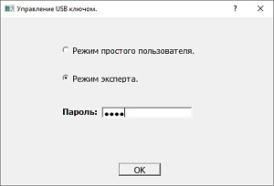

Если у вас надписи вылезли за размер кнопок – необходимо установить масштаб 100% и разрешение 1920х1080. Окно программы должно выглядеть как показано на рисунке: 

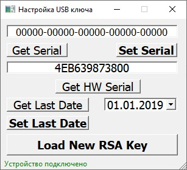

1. Устанавливаем дату, от которой вы хотите вести внутренний отсчет в днях – например 01.01.2023. Нажимаем кнопку «Set Last Date». Наличие даты необходимо для исключения возможностей ее подделки на ПК, где будет работать защищаемая программа. 
Потребуется ключ продукта и ключ rsa .

2. Копируем файл ключа «privateKey» в папку где собрана программа (\KeyProger\Win32\Debug\). 
Нажимаем кнопку «Load New RSA Key». Программа считает закрытый ключ rsa. В корне защищаемой программы будет создан заголовочный файл (ProtectionApp\uVectors.h), содержащий зашифрованный закрытый ключ (при сборке программы он будет вшит  в нее).  В аппаратный ключ будет записан модуль n закрытого ключа rsa. Длина модуля 256 байт.

3. Далее нам потребуется актуальный серийный ключ продукта. Запустим проект ProductKeyGen. 
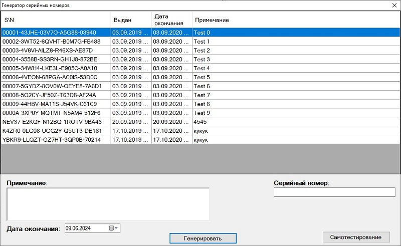 
Вводим примечание, нажимаем  «Генерировать». 
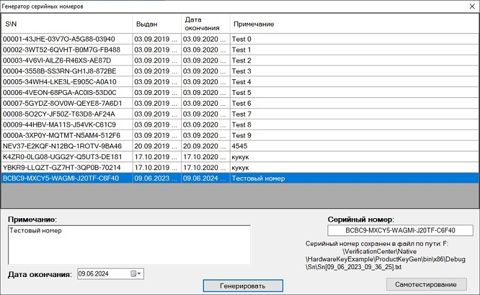 

4. Копируем серийный номер продукта "BCBC9-MXCY5-WAGMI-J20TF-C6F40". Очищаем поле ввода, содержащее 5 групп нулей. Вставляем скопированную строку. Очищаем поле ввода, содержащее 5 групп нулей. Вставляем скопированную строку. Нажимаем «SetSerial». 
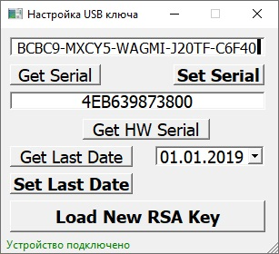 

Запускаем защищаемое приложение (ProtectionApp), видим разблокированную форму входа. 
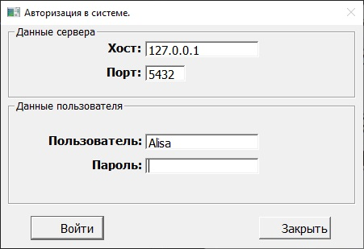 

