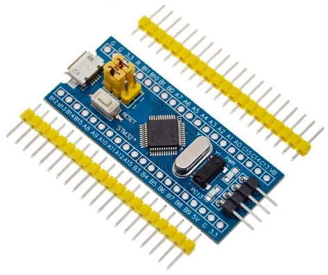
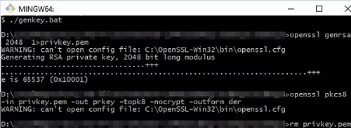
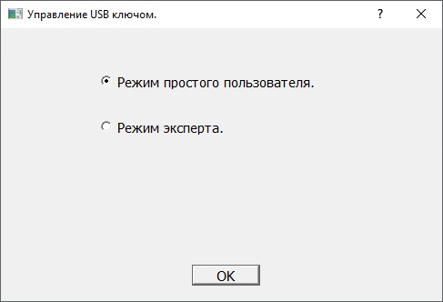
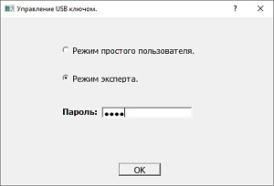
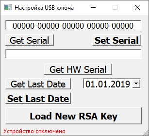

<h2 align="center">Настройка USB ключа.</h2>

Для создания аппаратного ключа потребуется плата с микроконтроллером stm32f103c8t6. 
Подобная плата обычно имеет название «stm32 blue pill» или «отладочная плата STM32». Важно купить плату с оригинальным микроконтроллером от фирмы st microelectronics. Так как существует достаточно много копий с китайским ARM. 

Скачиваем IDE Keil v5.36. Собираем прошивку из \HardwareProjects\STM32UsbKey.
Или берем готовую из \Binaries\STM32UsbKeyFirmware.zip. Прошиваем микроконтроллер.

Генерируем ключ RSA, которым микроконтроллер будет шифровать сеансовый ключ.
Для этого из Git Bash запускаем \Native\HardwareKeyExample\KeyProger\genkey.bat.
Git Bash знает где лежит openssl, поэтому используем его. 

В .bat файле указано: 
Генерация RSA ключа длиной 2048 бит, и помещение его в .pem контейнер. 
Конвертируем ключ из формата .pem в pkc8. 
Удаление ключа в формате pem. 

Для загрузки серийного номера и ключа RSA в флеш память микроконтроллера, используется программа «KeyProger».
Исходники можно найти в \Native\HardwareKeyExample\KeyProger

После запуска – возможен выбор двух режимов. 

Режим «простого пользователя» позволяет загрузить серийный номер и ключ RSA: 

Для входа в режим «эксперт» потребуется ввести пароль, прописанный в файле \Native\HardwareKeyExample\KeyProger\config.h 

Режим «зксперт» позволяет получить все данные: 

Для загрузки RSA ключа необходимо нажать «LoadNewRSAKey». 

Программа считывает файл prkey (полученный в предыдущих шагах и находящийся в корне проекта KeyProger).
Создаст uVectors.h, в корне защищаемой программы(KeyDistributionCenter). uVectors.h – содержит закодированный специальным алгоритмом ключ rsa в виде бинарного массива. Массив вшивается в защищаемую программу при сборке.
Далее из prkey считывается модуль n алгоритма rsa длиной 256 байт. Модуль отправляется микроконтроллеру, который зашивает его во флеш память.

