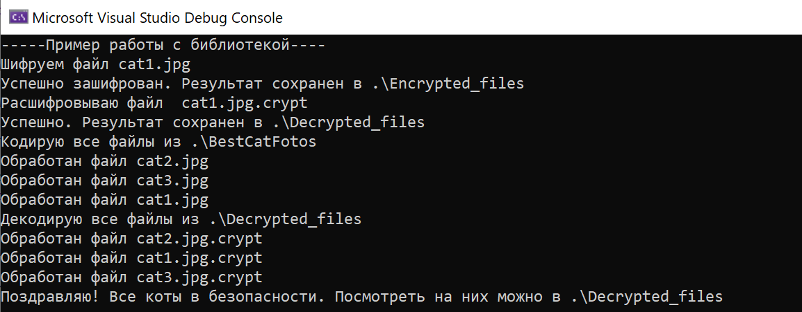
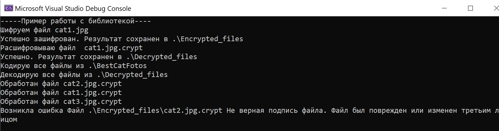

Приложение использует существующие интерфейсы использующие функции библиотеки для кодирования и декодирования файлов.
В примере предоставлены варианты кодирования одного или несколько файлов(параллельные операции). 

Вывод в консоль демонстрационной программы(для .NET). 

 

Так работает проверка целостности файла-изменены байты в файле.

