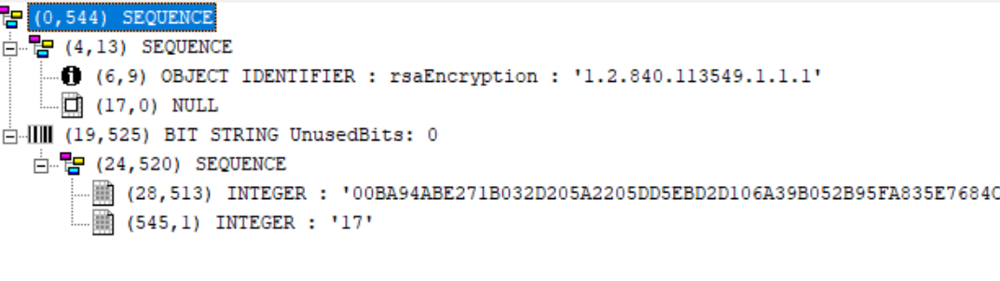
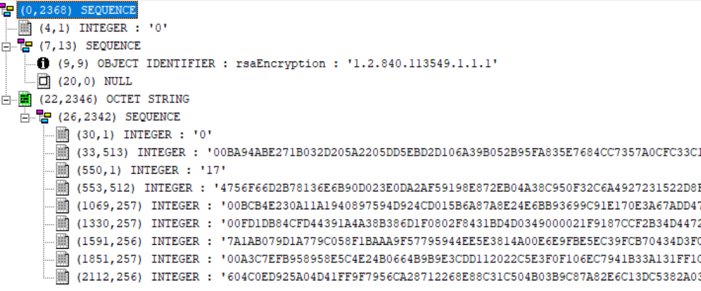

<h2>Асиметричный алгоритм шифрования RSA</h2>

Используется для шифрования сеансового ключа(случайное число выступающее ключем для блочного шифра). 

Открытый ключ RSA в формате ANS1 используемый в системе:

Закрытый ключ RSA длиной 4096 бит, используемый в системе:

