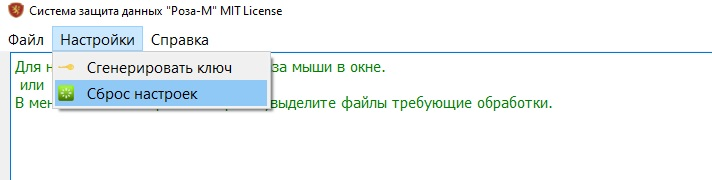
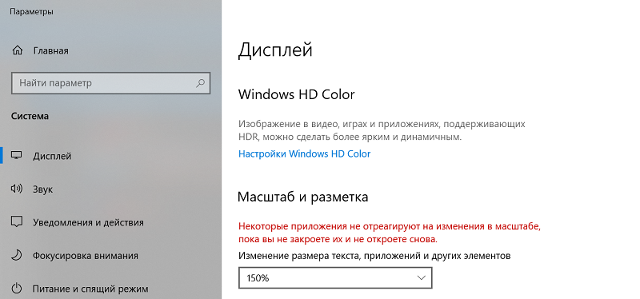

<h1 align="center">Система защиты данных «Роза-М»</h1>

<h2 align="center">Краткое описание.</h2>

Программа предназначена для автономной защиты файлов без использования удостоверяющего центра. 

 Используется гибридный алгоритм шифрования(симметричный: ГОСТ 34.12- 2015, ГОСТ 34.13-2015, ассиметричный-RSA 4096). Для реализации данных алгоритмов используется собственная библиотека шифрования, формат ключа, формат файла.
 

 

Программа позволяет шифровать не ограниченное количество файлов, а также большие файлы.
После шифрования файла, производится наложение электронно-цифровой подписи(ГОСТ 34.10-2012). 

Внешний вид главного окна программы:

Для начала работы с программой необходимо сгенерировать закрытый(и открытый) ключ шифрования, который будет помещен в секретный ключевой контейнер.
Для генерация ключа используется биологический датчик случайных чисел.

В меню «Настройки» выберите пункт «Сгенерировать ключ»:

В появившемся окне выберите путь к папке в которую будет сохранен сгенерированный ключ. 
ВНИМАНИЕ! Утеря ключа шифрования приведет к невозможности расшифровки файлов.

Нажимайте любые клавиши. Будет считан период между нажатиями клавиш и длительность нажатия. Полученные данные будут использованы как случайное число для генерации закрытого ключа(так называемый биологический датчик случайных чисел).

Введите пароль для защиты ключевого контейнера.

 

Создание ключа(ключевого контейнера) завершено.

 

Теперь необходимо сбросить старый путь к секретному ключу(по умолчанию уже настроен в Portable версии):

 

Попробуем зашифровать файл:

 

Так как были сброшены настройки-программа попросит указать путь к секретному ключу(который сгенерировали):

 

И пароль защиты ключевого контейнера:

 

После этого файл будет зашифрован. 

 

Для большей наглядности на рисунках приведен процесс шифрования группы картинок.

Зашифрованные файлы будут помещены в отдельную папку.

 

Portable версию можно найти в ..\Binaries\Binaries.zip, проект в каталоге EasyCript.

 

В случае когда надписи на кнопках выходят за размер самих кнопок-необходимо уменьшить «масштаб» в операционной системе до 100%:

Автор не несет ответственности за использование программы или исходных кодов проекта.
Все ваши действия вы выполняете на свой страх и риск. 

<h4 align="left">