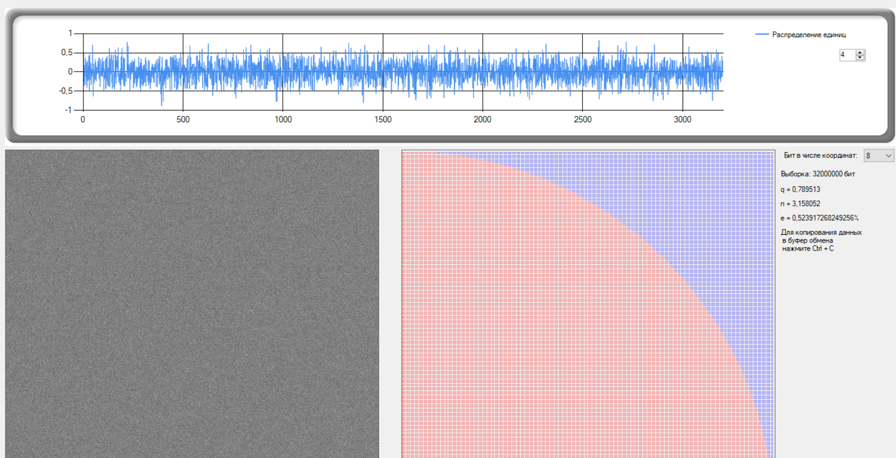

<h1 align="center">Система криптографической защиты информации «Гранит»</h1>

<h2 align="center">Краткое описание.</h2>

Qt C++,C# приложение, разработанное с использованием IDE Visual Studio. 

Читая данное описание вы соглашаетесь с MIT License.

Автору известны существующие ошибки и недоработки в коде. 
Ведется переделка на .NET 6 и максимальное удаление Qt кода.

Проект представляет полноценную законченную реализацию крипто алгоритмов, при необходимости позволяет изменить любой алгоритм на свое усмотрение.
С++ код максимально адаптирован для простоты использования.
Реализована Net 6 обвёртка для работы с С++ кодом. Представлен демонстрационный пример.
Основная цель проекта-простота и уверенность в отсутствии Backdoor’s. Проект был реализован после глубокого изучения существующих систем с открытым исходным кодом.
Ведется переделка неуправляемого кода на язык C#. За примерами на управляемом коде вы можете обратиться к разработчику.
Данный проект не является дипломной работой и т.п. 

Каталог <strong>Managed</strong> содержит решение LibExample(Net 6). 

<strong>Решение LibExample</strong> содержит:

<strong>Проект ManagedAdapter</strong>-интерфейс согласования Qt dll с Net 6(неуправляемого кода с управляемым) и его реализацию. Простое Api криптосистемы.

<strong>Проект Lib.Tests</strong> –тесты реализации интерфейса согласования. Тесты для Api пока не реализованы, ввиду постоянных переделок c++ кода.

<strong>Проект LibExample</strong>-<a href="./Doc/LibExample/LibExample.md">консольное приложение с демонстрационными примерами. </a>

Для запуска программы распакуйте Qt библиотеки Binaries\QtLibs.zip в \bin\Debug\net6.0\

MonteCarloAnalyzer- web, core 6 приложения для визуальной оценки работы генератора случайных(псевдослучайны) чисел. Пока реализован только сервис создания последовательности байт. Ведется разработка. Старым инструментом произведен анализ работы встроенного ГПСЧ.

<strong>Native</strong>-каталог содержит С++ библиотеку криптографии и Qt приложение. Ведется дальнейшая чистка решения.

  Решение состоит из:
  

  -Удостоверяющий центр(УЦ,он же центр распределения ключей)
  

  

   -Генератор закрытого ключа
  

   

    -Программа шифрования файлов
  

   

   -Аппаратный блок защиты УЦ(без него УЦ не запуститься)
  

   

     -Dll библиотека реализующая все основные функции
    (и пример ее использования)
   

   

   <a href="./Doc/RoseM/QuickQuide.md ">
     -Однокомпонентная программа шифрования данных "Роза" (проект EasyCript)
     </a>
  

   

     -Аппаратный криптографически устойчивый генератор случайных чисел(на основе шума p-n перехода транзистора)
  

  

  

Удостоверяющий центр, предназначен для создания пользовательских сертификатов, заменяет существующие платные удостоверяющие центры. Создает полноценные сертификаты, которые могут быть установлены в ОС Windows(при установке криптопровайдера поддерживающего ГОСТы).

Для кодирования и декодирования данных используется гибридное шифрование.
Блочный шифр: ГОСТ 34.12- 2015, ГОСТ 34.13-2015, ассиметричный-RSA 4096, подпись файлов - ГОСТ 34.10-2012. 

 

  Проект не использует стороннюю библиотеку OpenSSL,или ее части. Это позволяет избавиться от известных(и скрытых) уязвимостей OpenSSL, и при необходимости реализовывать новые алгоритмы кодирования.

  

Для работы с большими числами использована библиотека 
mpir. Для чтения ASN1 и шифрования RSA используется 
CryptoPP.

  

 Контейнер закрытого ключа использует собственный формат, похожий на ASN1.

  

Аппаратный блок защиты представляет собой плату на микроконтроллере STM32, которая хранит зашифрованный(AES) ключ и взаимодействует с ПО. На основе ряда простых математических функций реализован генератор ключа и его проверка.
Без блока удостоверяющий центр не запустится.

  

В рамках данной системы приведен упрощенный функционал по защите клиентского ПО от не санкционированного использования. Приведен генератор серийного номера и библиотека для его использования. 

Приведенный аппаратный криптографически устойчивый генератор случайных чисел не позволяет его напрямую подключить к существующему программному комплексу. После подачи питания происходит непрерывная генерация данных в файл на flash накопитель подключенный к схеме генератора. 
Проект MonteCarloRndAnalyse предназначен для визуальной оценке работы генераторов случайных чисел методом Монте-Карло. Проект требует рефакторинга и предоставлен исключительно как визуальное средство анализа данных.

<h4 align="left">
ПО «Роза-М» может использовать сертификаты сгенерированные удостоверяющим центром или работать автономно. В этом случае программа автоматические генерирует ключ и само подписанный сертификат. В таком режиме программа позволяет защищать файлы с использованием указанных выше криптографических алгоритмов.
</h4>

    <h2 align="center">Внешний вид ПО "Роза-M".  <a href="./Doc/RoseM/QuickQuide.md ">Инструкция</a> <a href="./Binaries/Binaries.zip"> Portable версия</a> </h2>

Это самостоятельная программа(не требует наличилия УЦ). Достаточно сгенерировать ключ, придумать пароль и программа может кодировать и декодировать файлы используя гибридное шифрование(симметричное и ассиметричное).

 

<h2 align="center">Внешний вид УЦ "ГранитК".</h2>

Удостоверяющий центр генерирует сертификаты, ведет базу действующих и аннулированых сертификатов. Для работы УЦ требуется установка БД postgresql.

 

<h2>Результат анализа работы ГПСЧ встроенного в Qt.</h2>
Из рисунка видно-встроенный генератор имеет ужасные характеристики. На порядок хуже ГПСЧ C#.

<h2 align="center">Аппаратный ключ защиты ПО.</h2>

 

<h2 align="center">Аппаратный генератор случайных чисел</h2>
Используется эффект шума p-n перехода транзистора.
Плата с микроконтроллером снята с основной платы.

 

<h2 align="center">Часть лога git.</h2>

 

<b>
Это некоммерческий проект. Исходный код предоставлен исключительно для ознакомительных и учебных целей.
</b>

